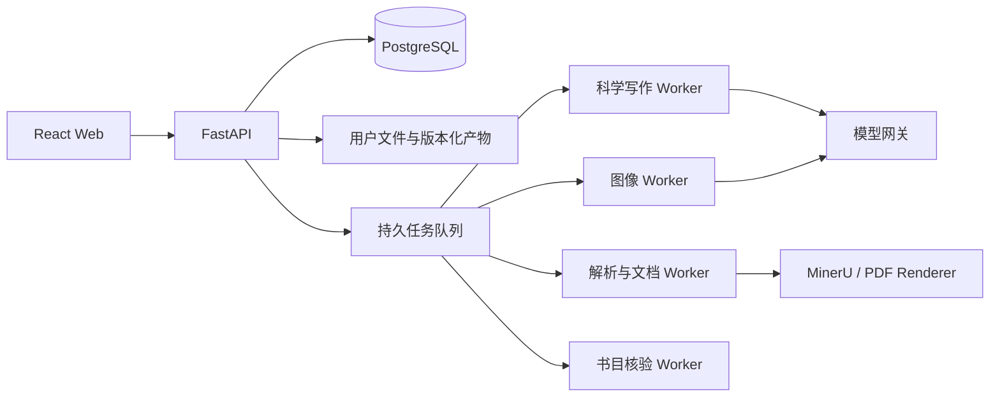

# Review Writer

Review Writer 是一个基于证据链的学术综述写作系统。它把论文解析、主题检索、证据整理、大纲规划、章节写作、图像处理、全文优化和文档导出组织成一条可恢复、可追溯的工作流。

系统重点支持化学论文中的反应式、机理图和分子结构，同时也可用于其他学科的文献综述。

仓库：<https://github.com/LCHTTTT/review-writer> · 当前发布分支：`dy-launch`。以下说明对应 2026-09-15 的代码实现。

## 核心功能

- **论文入库**：批量上传 PDF，通过 MinerU 提取 Markdown、版面结构、图片和书目信息。
- **主题检索**：结合题录规则、PostgreSQL 全文索引和向量语义召回筛选相关论文。
- **证据整理**：生成文献 Matrix、科学事实和可定位的原文证据，保留论文、事实、Claim 与引用的身份关系。
- **大纲与 Blueprint**：根据主题要求和实际证据建立章节结构，并为每章分配论文、科学问题和写作任务。
- **章节写作**：先生成 Claim 与证据计划，再生成正文，降低漏引、错引和无证据扩写。
- **图像处理**：支持原图选择、AI 重绘、SVG 对象编辑和 Ketcher 分子结构编辑。
- **初稿修订**：批量分析并生成段落候选，支持章节对话、手动编辑、候选采用或放弃及版本恢复；未采用候选不会替换当前正文。
- **终稿编辑与导出**：生成结论、摘要、关键词、参考文献和综述总览图，支持终稿段落编辑和版本恢复，导出 DOCX 或 PDF。
- **多用户运行**：隔离用户、项目、论文库、任务和文件，保存长任务状态，刷新页面后可继续查看进度。
- **服务端模型管理**：管理文本服务连接与模型目录、图像模型、向量模型和 MinerU，记录用量、费用与任务错误。

## 工作流程

1. **文献库**：上传并解析 PDF，确认书目信息和全文索引状态。
2. **检索筛选**：输入综述主题，检索候选论文并人工确认采用范围。
3. **分析与大纲**：生成 Matrix、科学事实、综述范围、大纲和章节 Blueprint。
4. **章节生成**：按 Blueprint、证据包和引用计划生成各章节正文。
5. **图像处理**：选择原图、重绘或编辑图片，并确定最终插图版本。
6. **初稿修订**：批量分析生成候选，通过章节对话或手动编辑完善正文，预览后人工确认。
7. **终稿发布**：生成结论与前置信息，编辑最终正文，生成 DOCX/PDF。

初稿批量修订按段落执行一次分析优化，失败段落单独记录，其余继续。候选需要确认后才写入正文。终稿以当前已保存版本为准；保存新版本后，旧 Word/PDF 会标记为过期，需要重新导出。生成任务期间如果终稿已有新修改，旧任务结果保留为候选，避免覆盖后保存的内容。

### 分类配置

| 配置 | 行为 |
| --- | --- |
| 通用学术 | 使用通用查询与全文召回，不启用化学别名扩展或化学标签加权 |
| 通用化学 | 在通用召回基础上增加化学别名和标签；联烯主题可以叠加专用规则 |

两项配置共用主工作流，不是两套独立写作系统。分类信息用于辅助检索和规划，不代替原文证据。项目进入 Matrix 后修改分类配置，需要确认；已有产物保留，Matrix 及后续阶段标记为需更新。

## 逻辑架构



- **React + TypeScript**：用户界面和七阶段工作台。
- **FastAPI**：用户、项目、文献、任务、产物和管理接口。
- **PostgreSQL**：业务状态、全文索引、文件版本引用、任务和用量账本。语义向量使用独立 SQLite 文件。
- **独立 Worker**：分别处理科学写作、论文解析/文档发布、书目核验和图像任务。
- **模型网关**：统一转发文本与图像模型请求，控制并发并记录费用。
- **LuaLaTeX Renderer**：生成独立的出版级 PDF。

## 仓库结构

| 目录 | 用途 |
| --- | --- |
| `frontend/` | React 工作台与前端测试 |
| `review_writer_api/` | 接口、任务队列、模型网关、权限与业务服务 |
| `review_writer_core/` | 证据、引用、分类和写作公共逻辑 |
| `skills/` | 运行所需的技能说明、脚本、提示词和模板 |
| `review_writer_pdf_renderer/` | 独立 PDF 渲染服务 |
| `migrations/` | 数据库迁移 |
| `tests/`、`review_writer_api/tests/` | 科学契约和后端测试 |
| `view/` | 解析辅助逻辑及编辑器资源 |

仓库不包含用户论文、运行数据、密钥、依赖缓存和本地辅助文档。`skills/` 中的 Markdown 提示词、图像模板和 DOCX 模板是运行依赖，需保留。

## Docker 部署

### 环境要求

- Git
- Docker Desktop 或 Docker Engine
- Docker Compose v2

### 1. 获取项目

```powershell
git clone --branch dy-launch https://github.com/LCHTTTT/review-writer.git
Set-Location review-writer
Copy-Item .env.hosted.example .env.hosted
```

### 2. 配置服务

编辑 `.env.hosted`，至少设置以下内容：

```dotenv
REVIEW_WRITER_POSTGRES_PASSWORD=数据库密码
REVIEW_WRITER_CREDENTIAL_ENCRYPTION_KEY=凭据加密密钥
REVIEW_WRITER_INTERNAL_WORKER_TOKEN=内部任务令牌
REVIEW_WRITER_PDF_RENDERER_TOKEN=PDF服务令牌

REVIEW_WRITER_OPENAI_API_KEY=文本模型密钥
REVIEW_WRITER_IMAGE_API_KEY=图像模型密钥
REVIEW_WRITER_MINERU_API_TOKEN=MinerU令牌

REVIEW_WRITER_ADMIN_EMAILS=owner@example.com
```

`.env.hosted` 包含敏感信息，不要提交到 Git。

注册验证码和忘记密码共用 SMTP 邮件服务。开放注册前还需设置 `REVIEW_WRITER_SMTP_HOST`、`REVIEW_WRITER_SMTP_PORT`、`REVIEW_WRITER_SMTP_SECURITY`、`REVIEW_WRITER_SMTP_USERNAME`、`REVIEW_WRITER_SMTP_PASSWORD` 和 `REVIEW_WRITER_SMTP_FROM_EMAIL`。安全模式按邮件服务要求选择 `starttls` 或 `tls`（隐式 TLS），密码可能需要填写邮件服务授权码。

加密密钥可使用 `python -c "import secrets; print(secrets.token_urlsafe(32))"` 生成。内部 Worker 令牌和 PDF 服务令牌应分别生成。将管理员邮箱设为实际注册使用的邮箱。

### 3. 启动

```powershell
# 先在 .env.hosted 中设置唯一版本号，例如 REVIEW_WRITER_IMAGE_TAG=release-20260915-01
docker compose --env-file .env.hosted build api pdf-renderer
docker compose --env-file .env.hosted up -d --no-build
docker compose --env-file .env.hosted ps
```

默认访问地址：<http://127.0.0.1:8770/>。

局域网部署可在 `.env.hosted` 中设置：

```dotenv
REVIEW_WRITER_PUBLIC_ORIGIN=http://192.168.0.5:5175
REVIEW_WRITER_BIND_ADDRESS=0.0.0.0
REVIEW_WRITER_HTTP_PORT=5175
REVIEW_WRITER_SESSION_COOKIE_SECURE=false
```

然后重新执行完整启动命令，同一局域网设备即可访问 <http://192.168.0.5:5175/>。服务器防火墙需要允许对应端口。

公网使用时配置真实 HTTPS 地址，并设置 `REVIEW_WRITER_SESSION_COOKIE_SECURE=true`。HTTPS 需要反向代理或其他 TLS 接入服务，修改 `PUBLIC_ORIGIN` 本身不会启用 HTTPS。多个访问地址可写入 `REVIEW_WRITER_ALLOWED_BROWSER_ORIGINS`，以逗号分隔；HTTPS 安全 Cookie 不会在普通 HTTP 地址下发送。

### 4. 更新与维护

```powershell
git pull origin dy-launch
# 在 .env.hosted 中更新为新的唯一 REVIEW_WRITER_IMAGE_TAG 后执行：
docker compose --env-file .env.hosted build api pdf-renderer
docker compose --env-file .env.hosted up -d --no-build --force-recreate migrate
docker compose --env-file .env.hosted up -d --no-build
```

更新前先备份并等待活动任务结束。API、模型网关、迁移服务和所有 Worker 应使用同一个应用镜像摘要；独立 PDF Renderer 使用相同发布标签。确认迁移成功、服务健康且配置的公开地址可访问后，再清理本项目未被任何容器引用的旧镜像。不要强制删除镜像、数据库镜像、持久卷或其他项目资源。

查看状态和日志：

```powershell
docker compose --env-file .env.hosted ps
docker compose --env-file .env.hosted logs -f api worker worker-ingest-document worker-bibliography worker-image model-gateway
```

停止服务：

```powershell
docker compose --env-file .env.hosted down
```

不要执行 `docker compose down -v`，除非确定要永久删除数据库和用户文件。

## 文本模型与分组配置

在管理后台 → 模型与服务 → 文本生成中配置：

1. **文本服务连接**：为每个平台或分组填写名称、Base URL、协议及该分组的 API Key。分组权限取决于密钥，名称只用于后台识别。
2. **文本模型目录**：每个模型绑定一个连接，填写平台模型名称、用户可见名称及输入、缓存输入、输出价格。不同连接可以提供同一个平台模型，使用不同目录 ID 区分。
3. 保存后点击“测试模型”验证实际调用及 JSON 输出。测试会产生真实请求，可能收费。

用户只选择模型，不需要选择分组或配置密钥。系统不会自动切换连接。旧单连接配置会首次迁入“默认连接”，原模型选择不变；迁入后在后台管理连接，修改环境变量不会覆盖已保存连接。

已提交任务保留模型、价格及连接版本；配置修改或停用只影响新任务。密钥留空表示保留原值，旧连接版本加密保留供已提交任务和重试使用。如果密钥泄漏，需要同时在上游平台撤销密钥并取消相关任务；仅停用连接不会撤销旧版本。

### 图像、向量与解析服务

- **图像**：填写实际可用的模型名、Base URL、密钥和接口协议。后台提供 Images API 与 Chat Completions；应选择上游实际支持的协议。保存模型名不代表上游已开放该模型。
- **质量参数兼容**：请求默认使用 `high`。仅当接口明确返回唯一支持的质量值时，系统调整该参数后重试一次；不会按模型名字盲目降级，也不会自动切换其他模型。
- **向量检索**：配置支持 `/embeddings` 的服务、模型及正确维度。向量保存在用户隔离的 SQLite 文件中，PostgreSQL 保存业务状态和全文索引。
- **MinerU**：用于 PDF 解析。邮件、图像、文本和解析服务配置相互独立。

### 常见问题

| 现象 | 检查方式 |
| --- | --- |
| 模型未向当前分组开放 | 核对模型绑定的连接及其密钥权限；重复提交不会恢复权限 |
| 图像接口拒绝 quality | 检查上游支持值，并确认网关已部署质量参数兼容版本 |
| Request origin is not allowed | 核对浏览器地址与公开地址、额外允许来源配置 |
| 注册验证码发送失败 | 检查 SMTP 配置和邮件服务授权码 |
| 导出文件显示过期 | 当前终稿已有新版本，重新生成 DOCX/PDF |

## 开发验证

```powershell
Set-Location frontend
npm ci
npm test
npm run build
Set-Location ..

python -m pip install -r requirements.txt "pytest>=8,<10"
python -m compileall -q review_writer_api review_writer_core review_writer_pdf_renderer view
python -m pytest -q --import-mode=importlib tests review_writer_api/tests
```

数据库集成测试使用独立测试数据库，相关环境配置参见 [CI 工作流](.github/workflows/api-foundation.yml)。不要把测试数据库地址指向生产实例。CI 在 `dy`、`dy-launch` 分支推送和 Pull Request 时执行。

## 数据与备份

Compose 使用两个主要持久卷：

- `postgres_data`：用户、项目、任务、余额和产物索引。
- `review_state`：论文 PDF、MinerU 解析结果、草稿、图片和导出文件。

默认 Compose 项目名为 `review-writer`，对应卷通常名为 `review-writer_postgres_data` 和 `review-writer_review_state`。用户文件位于容器内 `/app/.review-writer/hosted-workspaces/<用户ID>/`，包括用户文献库和各项目产物；Docker Desktop 在其 Linux 数据存储中管理这些卷。

正式使用时应同时备份两个卷，并妥善保存 `.env.hosted` 和 `REVIEW_WRITER_CREDENTIAL_ENCRYPTION_KEY`。只备份数据库无法恢复论文和图片，只备份文件也无法恢复完整项目状态与加密服务配置。
